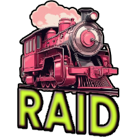

# RaidTrainTV



## Sections
- [Description](#project-description)
- [How to Contribute](#how-to-contribute)
- [Tech Stack](#tech-stack-needs)
- [Brain Dump](#brain-dump-wants)
- [Backlog](#backlog)

## Project Description

A Raid Train on Twitch is essentially a music festival or equivalent that includes new artists every ~hour and the train simply raids into the next artist. Raidtrain.tv will be a website for organizers to host their raid trains and for patrons to find where the train is such that they can join at any time. This experience should be seemless and hopefully include an embedded version of the active entertainer.


MVP: Minimal Viable Product

There will be a single page per organizer that will display the raid trains that organizer has set up. This page, for patrons (ID based) will be read only.


## How to Contribute
[Krikit](https://github.com/DuckTapeDevOps/RaidTrainTV/pull/36)
### Initial Setup

- Fork the repo
- Clone to your machine
- Create a new branch
- Get contributing!

### TLDR How to CRUD RaidTrains & Timeslots
- Navigate to /assets/raid_trains.yaml
- Duplicate / Remove / Alter the data you need. The website will render the data from top to bottom.
- When you are done, save the file, push to github, and open a PR 😀


### Database Structure

#### Creating a new train

``` yaml
# Inside \assets\raid_trains.yaml
# Each Raid train requires a 'host' followed by an array of 'raids'

- host: HostChannelName #DuckTapeDevOps
    raids:  #The list of raids
        - name: Raid Theme Name #Pitch Practice
```

#### Creating new event days

``` yaml
# Inside \assets\raid_trains.yaml
# Each raid train can have as many 'days' as you want, days can also be a 'sub event' within the raid train
# Days goes underneath the raids key

raids:  # The list of raids
    - name: Raid Theme Name # Pitch Practice
    days:
        - day: Monday, January 1, 2024
            events: # Each event or raid timeslot would go in this list
```

#### Creating new slots

``` yaml
# Inside \assets\raid_trains.yaml
# Within the events list we can create as many time slots as we want for that event.
# Each timeslot requires a time, user, and link to their channel.

events:  #The list of events
    - time: Thursday, January 25, 2024 14:00
        user: DuckTapeDevOps
        link: https://www.twitch.tv/ducktapedevops  # Link to the users channel.
```


## Tech Stack (Needs)


- Firebase
- React.js
- Firestore Database

------

## Brain Dump (Wants)


- S3 Front End
- CloudFront

## Backlog

- Discord Bot
- Twitch Bot

---


