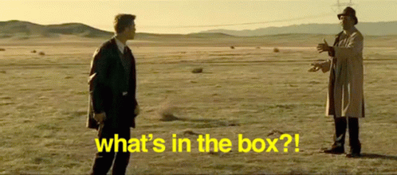

# RaidTrainTV
A Raid Train on Twitch is essentially a music festival or equivalent that includes new artists every ~hour and the train simply raids into the next artist. Raidtrain.tv will be a website for organizers to host their raid trains and for patrons to find where the train is such that they can join at any time. This experience should be seemless and hopefully include an embedded version of the active entertainer.

MVP: Minimal Viable Product

There will be a single page per organizer that will display the raid trains that organizer has set up. This page, for patrons (ID based) will be read only.

## Tech Stack (Needs)

- Firebase
- React.js
- Firestore Database

------

## Brain Dump (Wants)

- S3 Front End
- CloudFront

## Backlog

- Discord Bot
- Twitch Bot

---

